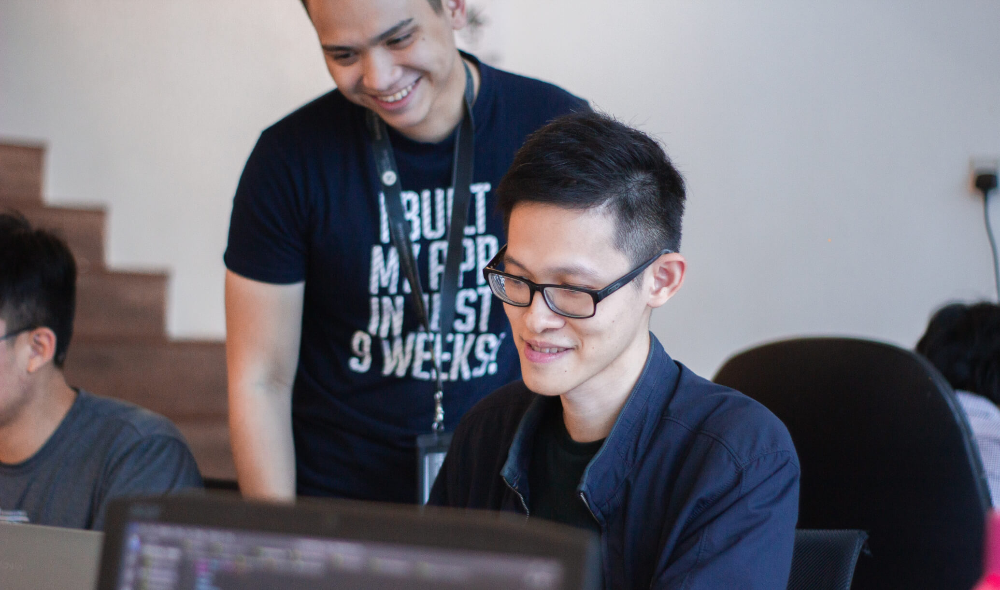

In this series, I will talk about my experience mentoring and teaching
developers. The take for you reading is learning from their story and seeing me
brag about my work.
[Read here to see why you need to brag about your work](https://jvns.ca/blog/brag-documents/).

## Introduction

Story of how I met [Kolade](https://www.linkedin.com/in/kaeyz/) and trained him
and we became brothers in Arm for life. He is currently a student in Germany and
works as a Developer remotely. I mean he is a proper Engineer who loves solving
complex problems and does not like easy things. He can be lazy (I did not say
that😜).

He came to EduLight consulting searching for a place where he could be trained
in coding more like a Bootcamp training in Ibadan. We did know each other from
Ladoke Akintola University of Technology (LAUTECH) as a casual acquaintances. We
sat down to talk and I sold to him learning JavaScript and he agreed to be my
student. There I did not know I was building the foundation of our friendship.

## Personal Bootcamp

We were together for months trying to distil the concepts of JavaScript. I
taught him HTML and CSS again because he had some prior experience that did not
measure up. He did not like writing CSS but was in awe of Bootstrap then. (Now
he is a great frontend engineer).

He built a [nairaland](https://www.nairaland.com/) clone of his own which I know
gave him a lot of confidence. The nairaland clone became his playground.

We tried to organize workshops together every Saturday to build a community we
named after the FreeCodeCamp effort from
[Quincy Larson](https://twitter.com/ossia).I asked him to acquire the JavaScript
certification on freeCodeCamp. We studied and solved problems together during
our training. After his training, we shipped him to Lagos with an internship
opportunity with a friend's company in need of a developer.

## Internship Experience

He worked with a senior developer that challenged him and made him better during
his internship experience. From intern, he was promoted to a full-time role and
I could easily say he his one of the best I have ever trained.

He developed his skill set and was dedicated to becoming a better developer.
Always asking questions, always trying things out, does not give up easily. He
worked on a TypeSript project around 2018 with just a little JavaScript
experience.

All through the internship experience we kept communicating and he shared all
his experience and we talked about technology and the Lagos tech community
together. We attended the concatenate conference together. We kept improving our
skills with training resources and building stuff out of what we learned.

## Moving Forward Out Of Nigeria

To further his education he migrated to Germany for education purposes, this
gave him access to a better standard of living in terms of the internet, power
supply and he had fewer things to bother him.

He was focused on his skill set development and getting a remote job in Germany
which he did. He has comfortably mentored others as well paying it forward.

## Our Presents

We randomly get on calls to share work-related tasks. He has taught me things in
Reactjs and frontend engineering in general. He shares the big dream of building
something large enough to set him up for life. He is keen on becoming a great
developer who keeps learning and building.

He is putting in the time and effort just so he can make the lives of everyone
around him better. I am proud of his present and optimistic about his future.

> "Mental toughness immediately increases when you find the right subject.
> You're more likely to stick with things when you're genuinely interested."

## Conclusion

Becoming a developer requires more patience, persistence and not giving up on
building the mental strength that will keep you going even when the bugs are
overwhelming and you seem not to just be good enough.

Kolade epitomised all the above traits and he alone deserves all the props for
the level of success he has attained and I believe he is just starting. He is a
reason I wake up to do what I do every day.
